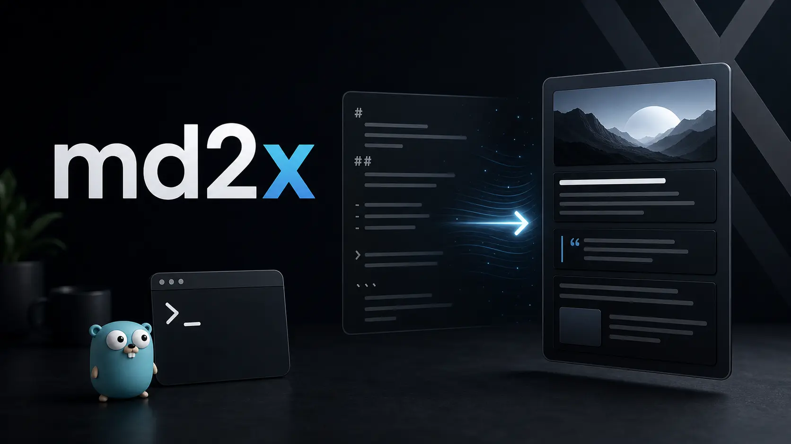

<div align="center">

# md2x

**面向 Agent Native 工作流的 Go CLI：把 Markdown 发布链路推进到 X Articles 草稿。**



[English](README.md) · [快速开始](docs/QUICKSTART.md) · [认证教程](docs/OAUTH2-PKCE.md) · [配置](docs/CONFIG.md) · [Markdown](docs/MARKDOWN.md) · [Agent 指南](docs/AGENT-GUIDE.md)

</div>

## 它解决什么问题

X Articles 不是普通 Markdown。官方 API 需要 DraftJS `content_state`、已上传的媒体 ID，以及用户上下文 OAuth2 授权。

md2x 把这条链路收敛成一个 Agent Native CLI：命令稳定、JSON 可机读、错误可诊断，适合人类终端和 Agent 自动化共同使用。

- `inspect`：在认证前检查 Markdown、frontmatter 和本地图片。
- `render`：离线生成可检查、可 diff 的 DraftJS JSON。
- `auth`：内置 OAuth2 PKCE 登录、状态检查、刷新和退出。
- `draft`：上传媒体并创建 X Article 草稿。

V1 默认只创建草稿，不自动发布。这样人类和 Agent 都能停在可审查状态。

## 快速开始

```bash
npm install -g @geekjourneyx/md2x
md2x inspect article.md --json
md2x render article.md --format draftjs --json
md2x config init --client-id YOUR_X_OAUTH2_CLIENT_ID
md2x auth login
md2x draft article.md --json
```

如果你已经在使用 `xurl` 保存 OAuth2 token，兼容路径仍然可用：

```bash
md2x draft article.md --app md2x --json
```

## 推荐工作流

先离线检查，再触发真实 X API：

```bash
md2x inspect article.md --json
md2x render article.md --format draftjs --json
md2x auth status --json
md2x draft article.md --json
```

`inspect` 和 `render` 不需要网络和认证，适合 CI、Agent 规划和人工审查。只有 `draft` 会调用 X API。

## OAuth2 认证

md2x 推荐使用内置 OAuth2 PKCE：

```bash
md2x config init --client-id YOUR_X_OAUTH2_CLIENT_ID
md2x auth login
md2x auth status
```

在 X Developer Portal 中需要开启 User authentication，并配置：

- App permissions: Read and write
- Callback URL: `http://127.0.0.1:8765/callback`
- Scopes: `tweet.read`, `tweet.write`, `users.read`, `media.write`, `offline.access`

完整教程见 [docs/OAUTH2-PKCE.md](docs/OAUTH2-PKCE.md)。

## 文档

- [英文 README](README.md)
- [快速开始](docs/QUICKSTART.md)
- [安装](docs/INSTALL.md)
- [认证](docs/AUTHENTICATION.md)
- [OAuth2 PKCE 教程](docs/OAUTH2-PKCE.md)
- [配置](docs/CONFIG.md)
- [使用说明](docs/USAGE.md)
- [Markdown 语法](docs/MARKDOWN.md)
- [X API 契约](docs/X-API.md)
- [Agent 指南](docs/AGENT-GUIDE.md)
- [故障排查](docs/TROUBLESHOOTING.md)

## 贡献

提交 PR 前请先阅读 [CONTRIBUTING.md](CONTRIBUTING.md) 和 [AGENTS.md](AGENTS.md)。

## 许可证

AGPL-3.0-only。商业授权见 [COMMERCIAL.md](COMMERCIAL.md)。
